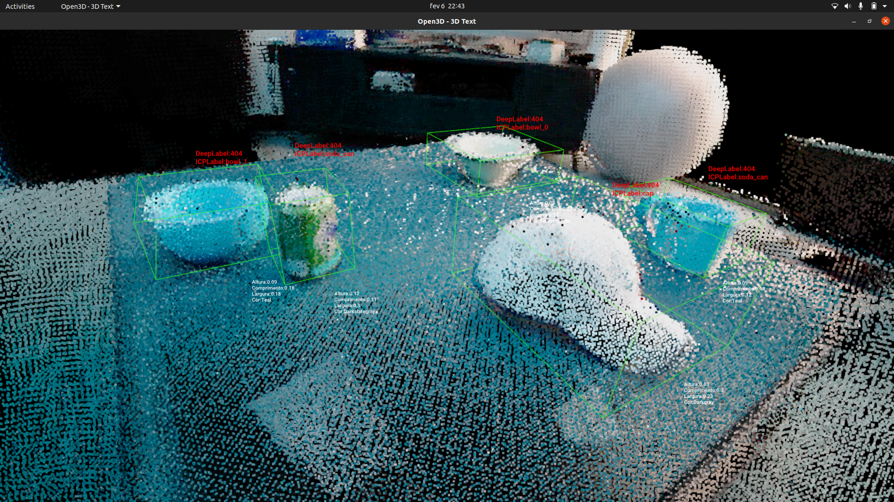
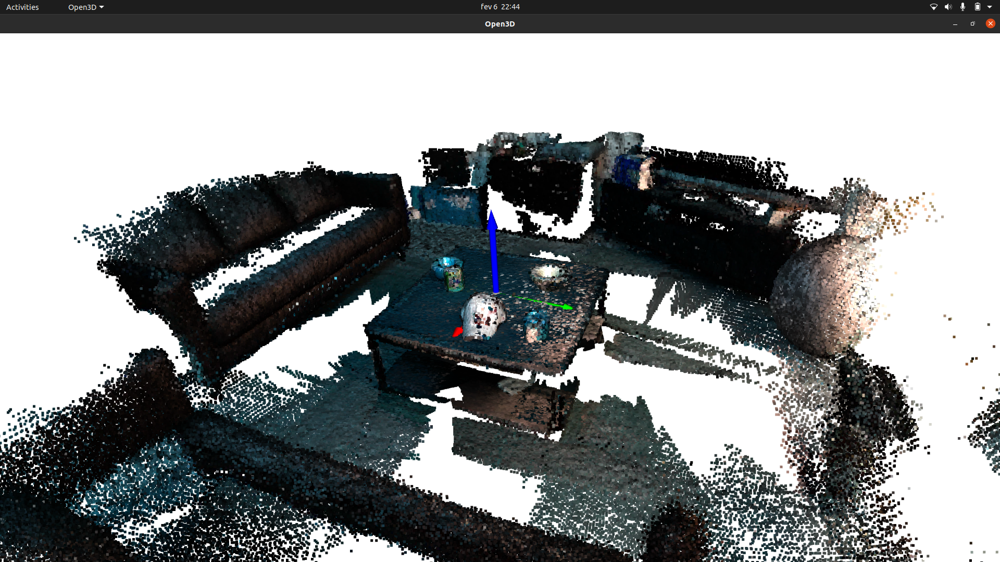
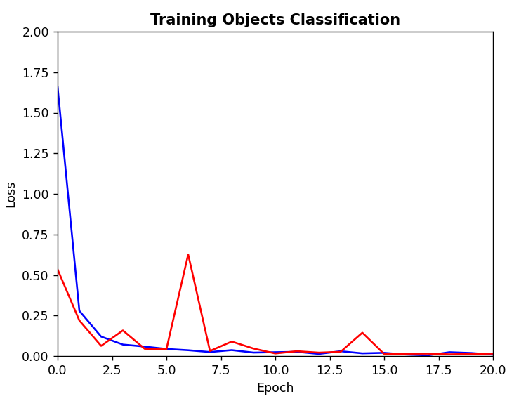

<!-- Improved compatibility of back to top link: See: https://github.com/othneildrew/Best-README-Template/pull/73 -->
<a name="readme-top"></a>
<!--
*** Thanks for checking out the Best-README-Template. If you have a suggestion
*** that would make this better, please fork the repo and create a pull request
*** or simply open an issue with the tag "enhancement".
*** Don't forget to give the project a star!
*** Thanks again! Now go create something AMAZING! :D
-->


<!-- PROJECT SHIELDS -->
<!--
*** I'm using markdown "reference style" links for readability.
*** Reference links are enclosed in brackets [ ] instead of parentheses ( ).
*** See the bottom of this document for the declaration of the reference variables
*** for contributors-url, forks-url, etc. This is an optional, concise syntax you may use.
*** https://www.markdownguide.org/basic-syntax/#reference-style-links
-->
<div align="center">

[![Contributors][contributors-shield]][contributors-url]


<!-- PROJECT LOGO -->
<br />

  <a href="https://github.com/mestrinio/SAVI_Trabalho2">
    
  </a>

<h3 align="center">SAVI - Trabalho Prático 2</h3>
<h3 align="center">MuG-21 "Fishbed"</h3>

<h2><b> Repository Owner: Pedro Martins 103800
<br>Collaborators: Emanuel Ramos 103838 & José Silva 103268 </b></h2>

  <p align="center">
  
    This repository was created for evaluation @ Advanced Systems of Industrial Vision "SAVI 23-24 Trabalho prático 2".
    <br />
    <!-- <a href="https://github.com/mestrinio/SAVI_Trabalho2"><strong>Explore the Wiki »</strong></a> -->
    <br >
    <a href="https://github.com/mestrinio/SAVI_Trabalho2/issues"> <u>Make Suggestion</u> </a>
  </p>
</div>
<br>

<div align="center">

</div>

<!-- TABLE OF CONTENTS -->
<details>
  <summary>Table of Contents</summary>
  <ol>
    <li>
      <a href="#about-the-assignment">About the assignment</a>
    </li>
     <li>
      <a href="#Objectives">Objectives</a>
    </li>
    <li>
      <a href="#getting-started">Getting Started</a>
      <ul>
        <li><a href="#Setup">Setup</a></li>
      </ul>
    </li>
    <li><a href="#usage">Usage</a></li>
    <li><a href="#contact">Contact</a></li>
    <li><a href="#acknowledgments">Acknowledgments</a></li>
  </ol>
</details>
<br>


<!-- ABOUT THE ASSIGNMENT -->
## About the Assignment
<div align="center">

</div>
<br>
This assignment was developed for Advanced Systems of Industrial Vision (course at University of Aveiro as part of Mechanical Engineering Masters). The program is defined as an advanced perception system that processes data incoming from 3D sensors and RGB normal cameras. The objective is to detect objects presented in a scene, as well as estimate some of it's properties.
<p align="right">(<a href="#readme-top">back to top</a>)</p>


<!-- ### Built With

* [![Next][Next.js]][Next-url]
* [![React][React.js]][React-url]
* [![Vue][Vue.js]][Vue-url]
* [![Angular][Angular.io]][Angular-url]
* [![Svelte][Svelte.dev]][Svelte-url]
* [![Laravel][Laravel.com]][Laravel-url]
* [![Bootstrap][Bootstrap.com]][Bootstrap-url]
* [![JQuery][JQuery.com]][JQuery-url]

<p align="right">(<a href="#readme-top">back to top</a>)</p> -->


<!-- Objectives -->
## Objectives
### Training of a classifier in deep learning
The program is capable of detecting objects in a chosen scene, and then calculate various properties of the objects.
The object dataset is fully utilized to develop a deep learning network that is capable of classifying the objects. It is divided in training 80% and testing 20%. After being trained, it is able to calculate precision (global and per class).

***

### 3D Pre-processing
The systems processes the pointcloud of a scene and isolates the objects. Then calculates the following properties:
- Color
- Length
- Height
- Width

***

### Classification of the objects in the scene
#### Using 2D Classifier
The segmentation of objects in the pointclouds is used to discover the zone where the object is in the RGB image. From here a sub-image that contains only the object is obtained and given to the previous network for new training.

<div align="center">

</div>

#### Using 3D Classifier
After removing the separate objects from the scene's pointcloud, the script will execute a comparison between the object and every pointcloud object from a 3D dataset, performing the ICP (Iterative Closest Point) algorithm and comparing rmse (error measurement) and confirming if the object belongs in the dataset and if so, which one it is, giving it the corresponding label. 

***

### Audio description of the scene
A speech synthesizer is used to verbally describe what objects with what properties are found in the scene.

***

### Perfomance metrics
The 2D Classifier model is classified by using perfomance metrics. For the object detectors, the following perfomance metrics are defined:
- Precision
- Recall
- F1 Score

Classes used on scene 1:
{'class_index': 5, 'class_label': 'bowl', 'metrics': {'precision': 1.0, 'recall': 1.0, 'f1_score': 1.0, 'TP': 57, 'TN': 3391, 'FP': 0, 'FN': 0}}  
{'class_index': 8, 'class_label': 'cap', 'metrics': {'precision': 0.9850746268656716, 'recall': 1.0, 'f1_score': 0.9924812030075187, 'TP': 66, 'TN': 3381, 'FP': 1, 'FN': 0}}
{'class_index': 11, 'class_label': 'coffee_mug', 'metrics': {'precision': 1.0, 'recall': 1.0, 'f1_score': 1.0, 'TP': 47, 'TN': 3401, 'FP': 0, 'FN': 0}}
{'class_index': 44, 'class_label': 'soda_can', 'metrics': {'precision': 0.9848484848484849, 'recall': 1.0, 'f1_score': 0.9923664122137404, 'TP': 65, 'TN': 3382, 'FP': 1, 'FN': 0}}
***

### Real(not time) test
The program can be ran using a RGB-D camera on the real world, and trying the detection of objects on top of a table. It captures and shows the feed from the camera and then, on command, captures an image, saving it as a scene ready to be ran by the main script.

***

<br>
<br>
<br>

# MuG-21 "Fishbed"

Let's get started:

<!-- GETTING STARTED -->
## Getting Started

This is a Python file, so it should be ran in a dedicated terminal. But first, a setup of the required libraries must be performed.

Example:
```
./main.py -s '/home/mestre/Desktop/SAVI/REPO_eu_SAVI/TP2/SAVI_Trabalho2/rgbd-scenes-v2/pcdscenes/01.pcd'
```


## Setup
To run the open3D GUI scene visualizer, you need to be running the minimum version of python 3.10 with open3D's version as at least 0.15.0.
The following libraries require installation:

Note: 'torch' can be installed using CPU or GPU support.
```
sudo apt install python3 python3-tk
sudo apt install python3-pygame
pip3 install torch torchvision torchaudio --index-url https://download.pytorch.org/whl/cpu
pip3 install torch torchvision torchaudio
pip install torch
pip install matplotlib
pip install webcolors
pip install pyrealsense2
pip install gTTS
pip install pygame
pip install opencv-python
pip install numpy
```


<!-- USAGE EXAMPLES -->
## Usage

### How it works

Run main.py:
- Check if the first window that appears corresponds to the desired scene.
- Close the window and let the script run the detections and show the final scene identified with labels, bounding boxes and properties.


***

Arguments when running main.py:
- '-h' for help, to remember the arguments
- '-s' '/scene.pcd' here goes the path to the pointcloud scene that wants to be analyzed (default scene: 01.pcd)
- '-cam' 1 if wished to run a scene captured by the RBG-D camera (0 = default).

***

### Running
When running the script, it will first select the scene you've chosen, either one taken from the folder of the given dataset, or a capture from the RGB-D camera.

After loading the scene, the program will start separating the objects from the rest of the scene. When all are separated, it will run through the detection models and calculate the corresponding object label that best fits the pointcloud. 

Visualization:
- every object will appear labelled with either a right (or wrong) detection or a error label if not detected properly by the 2D model
- below the objects the corresponding properties of color and dimensions will also show up
- bounding boxes will bound every object for better visualization of the separations made.

### Voice-over
The whole script will be notifying you via generated audio, letting you know the status of everything, what it is doing and what were the detections that it made, while also saying every object's properties.

***
<br>

<!-- CONTACT -->
## Contact
Emanuel Ramos - eramos@ua.pt


José Silva - josesilva8@ua.pt


Pedro Martins - pedro.mestre@ua.pt


Project Link: [Trabalho Prático 2](https://github.com/mestrinio/SAVI_Trabalho2)

<p align="right">(<a href="#readme-top">back to top</a>)</p>


<!-- ACKNOWLEDGMENTS -->
## Acknowledgments

* Professor Miguel Oliveira - mriem@ua.pt

<p align="right">(<a href="#readme-top">back to top</a>)</p>


<!-- MARKDOWN LINKS & IMAGES -->
<!-- https://www.markdownguide.org/basic-syntax/#reference-style-links -->
[contributors-shield]: https://img.shields.io/github/contributors/RobutlerAlberto/RobutlerAlberto.svg?style=for-the-badge
[contributors-url]: https://github.com/mestrinio/SAVI_Trabalho2/graphs/contributors
[product-screenshot]: docs/logo.png
